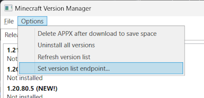
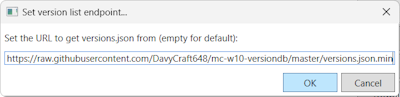

# mc-w10-versiondb

The data presented here is gathered using the tool https://github.com/MCMrARM/updateprocessor.

**Important Note:** Due to limitations, historical version information can only be included if it was captured prior to the release of the subsequent version. As a result, this may not contain complete information for all older versions.

## Use this in MCLauncher

1. Go to Options > Set version list endpoint...
2. Paste `https://raw.githubusercontent.com/DavyCraft648/mc-w10-versiondb/master/versions.json.min` to the input box, then click OK

